# Small Sensor Operational Overview

Assembly instructions and operation of a user assembled particulate sensor logger based around the Shinyei PPD42 dust sensor and DHT22 temperature and humidity sensor.

## Bill of Materials

Item	                                           | Cost (USD)| Source
-------------------------------------------------|----------:|-------------------------------------------------------------------------
Shinyei PPD42NJ Dust Sensor                      |      $10  | [Aliexpress](https://www.aliexpress.com/item/SHINYEI-dust-sensor-PPD42NS-PPD4NS-PPD42NJ-dust-sensor-with-cable/32305336628.html) or [Ebay](http://www.ebay.com/itm/ORIGINAL-Brand-New-SHINYEI-Dust-Sensor-PPD42NJ-PPD42NS-with-Cable-/271927031774)
DHT22 Temperature Humidity Sensor                |       $3  | [Aliexpress](https://www.aliexpress.com/item/50PCS-LOT-DHT22-AM2302-Digital-Temperature-and-Humidity-Sensor-DHT22-Free-shiping/1699337492.html)
Arduino Pro Micro, ATMega32U4-5V 16Mhz 	         |       $4  | [Ebay](http://www.ebay.com/itm/332166215715)
Mini Datalogger with microSD card reader and RTC |       $4  | [Ebay](http://www.ebay.com/itm/112160970687)
MicroSD Card                                     |       $5  | [Ebay](http://www.ebay.com/itm/New-Sandisk-4GB-Class-4-MicroSD-MicroSDHC-SD-SDHC-Flash-Memory-Card-With-Adapter-/190889743342)
Datalogger/Screw Terminal Adapter                |       $6  |
Plastic Chassis, 3D printed                      |       $6  | 
USB Charger	                                     |       $6  | [Digikey](https://www.digikey.com/product-detail/en/qualtek/QFAW-05-05/Q971-ND/6412289) or [Sparkfun](https://www.sparkfun.com/products/11456)
#4-40 3/8" Self-Tapping Screws                   |       $1  | [Link](http://www.homedepot.com/p/Everbilt-4-x-3-8-in-Zinc-Plated-Steel-Phillips-Pan-Head-Sheet-Metal-Screw-16-per-Pack-812661/204275188)
USB Battery                                      |      $30  | [Ebay](http://www.ebay.com/itm/Anker-PowerCore-10000-Portable-Charger-One-of-the-Smallest-and-Lightest-10000mA/331901490667)
**Total**                                        |    **$75**|
**Total w/o battery or USB charger**             |    **$39**|  

**Note:** The Shinyei PPD42 is sensitive to small fluctuations in voltage, so using quality power supply components is recommended. Because the quality of USB chargers vary widely it is recommended to use a USB battery or charger from a major manufacturer.  [See here for more information on USB charger quality](http://www.righto.com/2012/10/a-dozen-usb-chargers-in-lab-apple-is.html).

## Software

The Arduino sketch responsible for taking readings from sensors and logging them to the SD card can be found here:  

## Assembly

1. Begin by snapping the Shinyei PPD42 into place in the rear of the insert. Make sure the sensor is held by the retaining clips and sits flush against the plastic holder.  

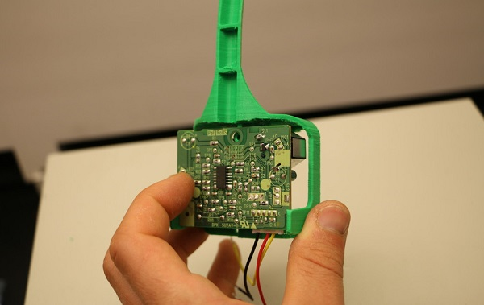  

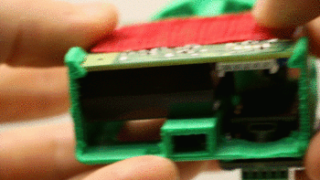

2. Secure the Shinyei in place with a screw. Only make this snug, don't overtighten.  

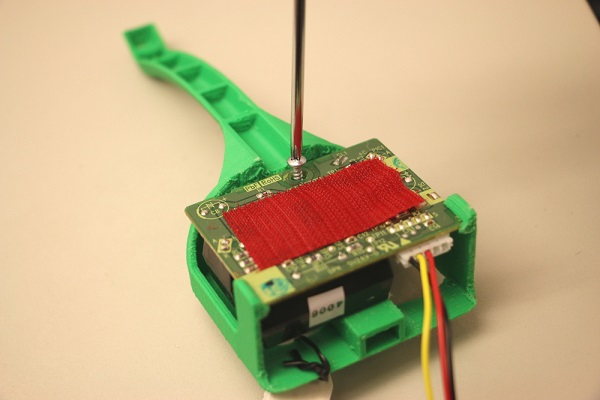

3. If required, mate the Pro Micro and the adapter shield together so they snap into place. Orient the USB port on the Pro Micro with the "USB" label on the adapter board.  

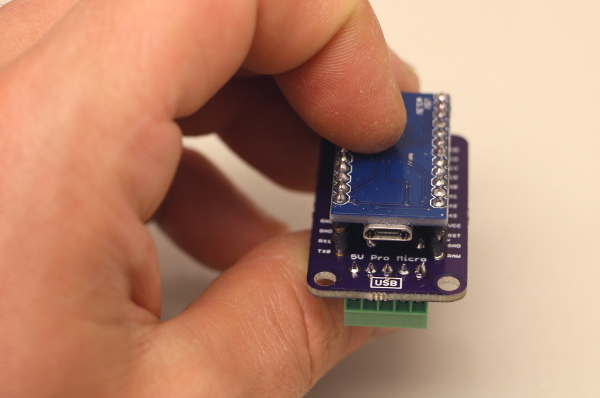

4. Screw the adapter board onto the front of the plastic insert so that the Pro Micro sits inside the unit.  

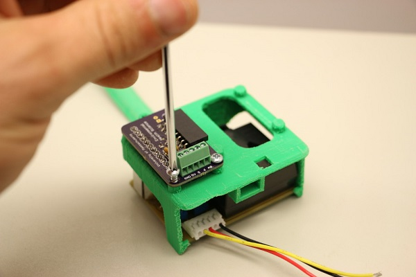

## Wiring Sensors
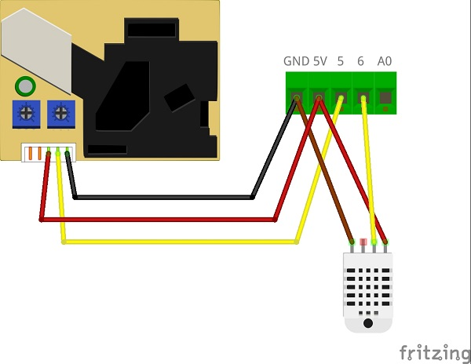

Wire the sensors to the Arduino using the screw terminal. The Shinyei and DHT22 must share 5V and GND connections from the screw terminal. 

5. Start by twisting the GND wires (black, brown, or gray) from the Shinyei and DHT22 together and secure them into the GND terminal.  

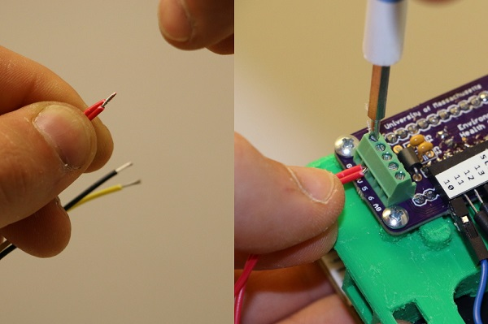

6. Next, do the same with the 5V wires (red). 

**NOTE:** Do NOT wire the two yellow wires together!

7. The yellow wire from the Shinyei goes to the terminal labeled 5. The middle wire from the DHT22 (yellow or purple) goes to terminal 6.  

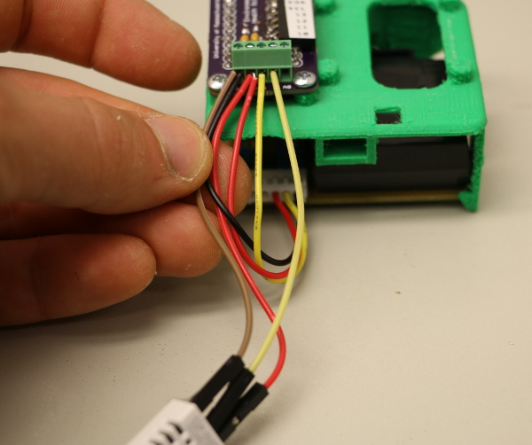

## Connect the Datalogging Shield

8. Wiring the datalogger consists of wiring the labeled femaled headers on the datalogger adapter with the corresponding pin on the logging shield.  

Adapter board pinout:  
5V - red  
GND - black  
SDA - blue  
SCL - yellow  
13 - green  
12 - white  
11 - orange  
10 - blue  

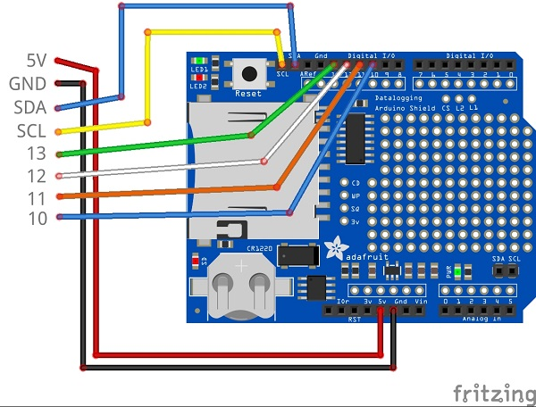  

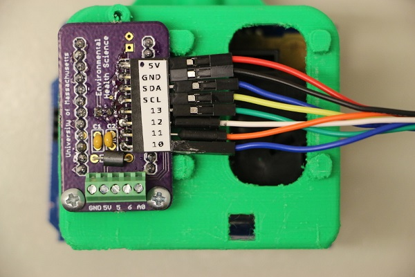  
Adapter board wiring.  

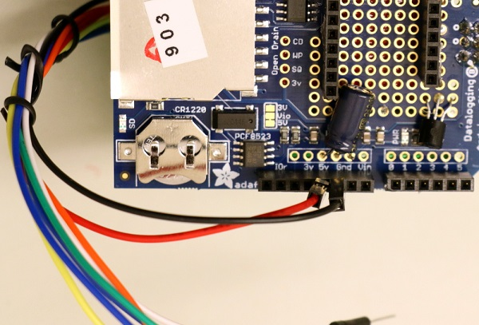  
5V and GND on the datalogger.

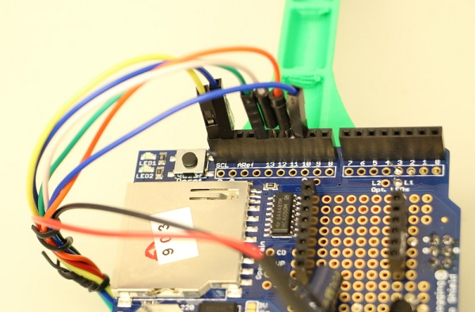  
Wiring of pins SCL, SDA, 13, 12, 11, 10  

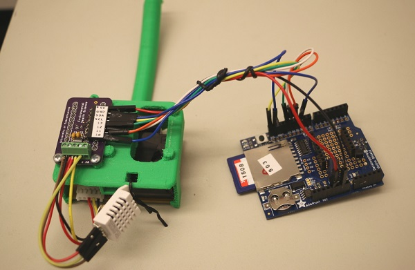  
Check your completed wiring against the wiring diagram, then attach the shield to the back of the Shinyei using velcro or rubber bands.

## Operation

You should be ready to go! Make sure a [properly formatted](https://www.sdcard.org/downloads/formatter_4/) SD card is plugged in all the way and plug the Pro Micro into USB power.

### Blinking lights?

When the device is powered on, sucessful initialization is indicated by an LED which **blinks 10 times**. A data record is logged every 30 seconds, indicated by a single LED blink. 

If no blinking light is observed when the sensor is powered up, the first thing to check is for the correct wiring of the SD card shield and that the card is well seated in it's holder.

### Pulling Data

Every time the device is powered on a new file is created with the naming scheme data00.txt, data01.txt, etc.

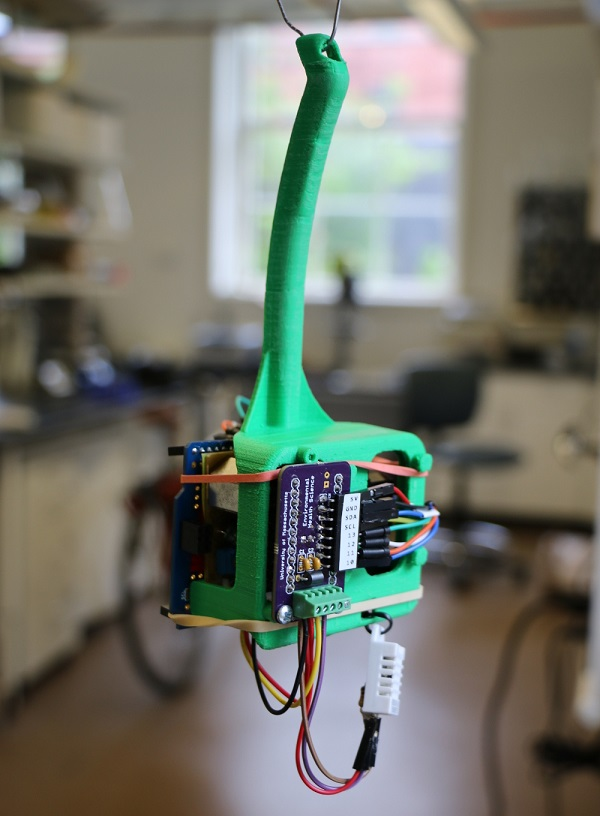
